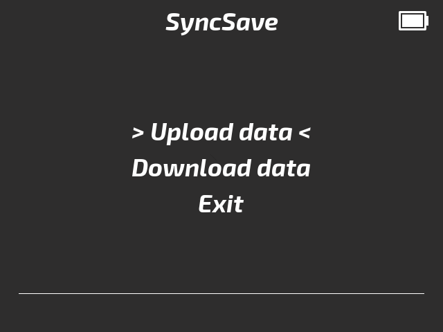
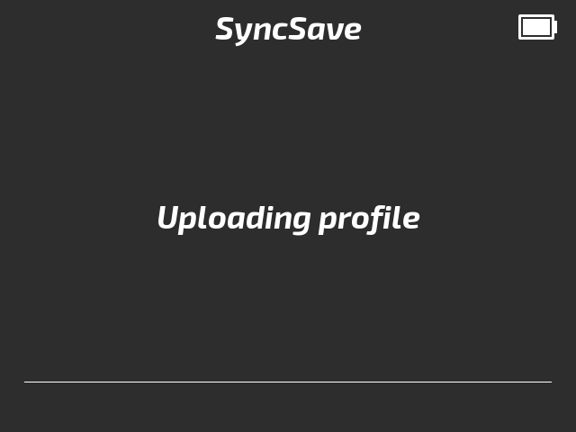
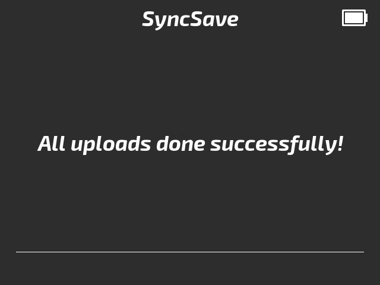

# SyncSave

[](https://github.com/ndeleforge/binocle/blob/main/LICENCE)

[](https://github.com/ndeleforge/binocle/network)
[](https://github.com/ndeleforge/binocle/stargazers)

Allow to sync - upload and download - your profile (saves) and screenshots from the Miyoo to any cloud compatible with rclone.
Heavily inspired by this projet : [cloud-saves-miyoo-mini-plus](https://github.com/hotcereal/cloud-saves-miyoo-mini-plus).

<div align="center">

  
  
  
  
</div>

## Table of contents

- [Installation](#installation)
- [Configuration](#configuration)
- [Usage](#usage)
- [Troubleshooting](#troubleshooting)
  - [Menu is lagging](#menu-is-lagging)
  - [Errors issues](#errors-issues)
  - [Logs](#logs)

## Installation

1. **Download rclone for ARM**

Download the ARMv7 32-bit version of rclone : [rclone website](https://downloads.rclone.org/v1.68.1/rclone-v1.68.1-linux-arm-v7.zip)

2. **Create the app structure**

Please keep this structure and these names if you do not want to edit the bash script too much.

   ```
   /mnt/SDCARD/App/SyncSave/
   ├── config.json
   ├── launch.sh
   ├── rclone
   ```

3. **Setup rclone**

Connect with SSH to your Miyoo mini plus and launch `./rclone config` to add new remote.  
Follow the instructions and then check that the `rclone.conf` is created beside the `rclone` binary.  

You can also do it on your computer, if it's Linux based.   And then just copy the conf file to the Miyoo.

## Configuration

Open `launch.sh` with a text editor and modify these settings to match your setup:

```bash
CLOUD_HOST="the hostname of your remote" 
CLOUD_PATH="cloud:/path/to/your/backup/folder"
```

If your remote is Google Drive or any external cloud providers, you can leave the `CLOUD_HOST` empty to by pass the cloud connection check. Otherwise put the IP address of your NAS for example.  
In the `CLOUD_PATH` variable, the first word is the name of your rclone remote. Modify it at your needs.

## Usage

1. **Launch SyncSave** from your Miyoo Mini Plus Apps menu
2. **Navigate** with D-pad (Up/Down)
3. **Select action**:
   - **Upload data**: Send profile (with saves) and screenshots to your remote
   - **Download data**: Retrieve profile (with saves) and screenshots from your remote
   - **Exit**: Close the application
4. **Confirm** with A button

## Troubleshooting

### Menu is slow
Yes, I know.

### Errors issues
1. **rclone / rclone.conf is missing**: Check that the rclone binary and it's configuration file are in the `syncsave` app folder.
2. **WI-FI disabled**: Activate the WI-FI in the MIyoo settings
3. **Remote not reachable**: The Miyoo cannot reach your remote, please check your config and test it.

### Logs
Check `/mnt/SDCARD/App/SyncSave/rclone.log` for detailed transfer information and error messages.
